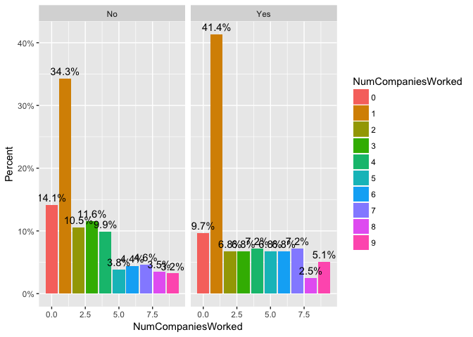

# Case Study2
Venkat Kasarla  
11/23/2017  


```r
rawdata.xls <- '../data/CaseStudy2-data.xlsx'
rawdata.csv <- '../data/original.csv'


refine <- read_excel(rawdata.xls,1)
refine %>% data.table::fwrite(rawdata.csv)
dframe <- read.csv(rawdata.csv)
rawdata <- dframe
```

<br>


```r
ggplot(rawdata,aes(Gender,fill=Attrition)) + geom_bar(position="dodge")
```

<!-- -->

```r
ggplot(rawdata,aes(Gender, group=Attrition))+
  geom_bar(aes(y=..prop..,fill=factor(..x..)),stat="count")+
  geom_text(aes(label=scales::percent(..prop..),
                y=..prop..),stat="count",vjust=-.5)+
  labs(y="Percent",fill="Gender")+
  scale_y_continuous(labels=scales::percent)+
  facet_grid(~Attrition)
```

<!-- -->

<br>


```r
ggplot(rawdata,aes(HourlyRate,fill=Attrition)) + geom_bar(position="dodge")
```

<!-- -->

```r
ggplot(rawdata,aes(HourlyRate, group=Attrition))+
  geom_bar(aes(y=..prop..,fill=factor(..x..)),stat="count")+
  geom_text(aes(label=scales::percent(..prop..),
                y=..prop..),stat="count",vjust=-.5,check_overlap = TRUE)+
  labs(y="Percent",fill="HourlyRate")+
  scale_y_continuous(labels=scales::percent)+
  
  facet_grid(~Attrition)
```

<!-- -->

<br>


```r
ggplot(rawdata,aes(JobInvolvement,fill=Attrition)) + geom_bar(position="dodge")
```

<!-- -->

```r
ggplot(rawdata,aes(JobInvolvement, group=Attrition))+
  geom_bar(aes(y=..prop..,fill=factor(..x..)),stat="count")+
  geom_text(aes(label=scales::percent(..prop..),
                y=..prop..),stat="count",vjust=-.5)+
  labs(y="Percent",fill="JobInvolvement")+
  scale_y_continuous(labels=scales::percent)+
  facet_grid(~Attrition)
```

<!-- -->

<br>


```r
ggplot(rawdata,aes(JobLevel,fill=Attrition)) + geom_bar(position="dodge")
```

<!-- -->

```r
ggplot(rawdata,aes(JobLevel, group=Attrition))+
  geom_bar(aes(y=..prop..,fill=factor(..x..)),stat="count")+
  geom_text(aes(label=scales::percent(..prop..),
                y=..prop..),stat="count",vjust=-.5)+
  labs(y="Percent",fill="JobLevel")+
  scale_y_continuous(labels=scales::percent)+
  facet_grid(~Attrition)
```

<!-- -->

<br>


```r
ggplot(rawdata,aes(JobRole,fill=Attrition)) + geom_bar(position="dodge")
```

<!-- -->

```r
ggplot(rawdata,aes(JobRole, group=Attrition))+
  geom_bar(aes(y=..prop..,fill=factor(..x..)),stat="count")+
  geom_text(aes(label=scales::percent(..prop..),
                y=..prop..),stat="count",vjust=-.5)+
  labs(y="Percent",fill="JobRole")+
  scale_y_continuous(labels=scales::percent)+
  theme(axis.text.x = element_text(angle=60, hjust=1)) +
  facet_grid(~Attrition)
```

<!-- -->

<br>


```r
ggplot(rawdata,aes(JobSatisfaction,fill=Attrition)) + geom_bar(position="dodge")
```

<!-- -->

```r
ggplot(rawdata,aes(JobSatisfaction, group=Attrition))+
  geom_bar(aes(y=..prop..,fill=factor(..x..)),stat="count")+
  geom_text(aes(label=scales::percent(..prop..),
                y=..prop..),stat="count",vjust=-.5)+
  labs(y="Percent",fill="JobSatisfaction")+
  scale_y_continuous(labels=scales::percent)+
  facet_grid(~Attrition)
```

<!-- -->

<br>


```r
ggplot(rawdata,aes(MaritalStatus,fill=Attrition)) + geom_bar(position="dodge")
```

<!-- -->

```r
ggplot(rawdata,aes(MaritalStatus, group=Attrition))+
  geom_bar(aes(y=..prop..,fill=factor(..x..)),stat="count")+
  geom_text(aes(label=scales::percent(..prop..),
                y=..prop..),stat="count",vjust=-.5)+
  labs(y="Percent",fill="MaritalStatus")+
  scale_y_continuous(labels=scales::percent)+
  facet_grid(~Attrition)
```

<!-- -->

<br>


```r
f <- function(x) {
  r <- quantile(x, probs = c(0.05, 0.25, 0.5, 0.75, 0.95))
  names(r) <- c("ymin", "lower", "middle", "upper", "ymax")
  r
}

ggplot(rawdata, aes(Attrition, MonthlyRate)) + stat_summary(fun.data = f, geom="boxplot")
```

<!-- -->

```r
# define outlier as you want 0-25%  and 75-100% outliers   
o <- function(x) {
  subset(x, x < quantile(x)[2] | quantile(x)[4] < x)
}

#Monthly Rate
ggplot(rawdata, aes(Attrition, MonthlyRate)) + 
  stat_summary(fun.data=f, geom="boxplot") + 
  stat_summary(fun.y = o, geom="point")
```

<!-- -->

```r
#Hourly Rate
ggplot(rawdata, aes(Attrition, HourlyRate)) + 
  stat_summary(fun.data=f, geom="boxplot") + 
  stat_summary(fun.y = o, geom="point")
```

<!-- -->

<br>


```r
#Monthly Income
ggplot(rawdata, aes(Attrition, MonthlyIncome)) + 
  stat_summary(fun.data=f, geom="boxplot") + 
  stat_summary(fun.y = o, geom="point")
```

<!-- -->

<br>


```r
ggplot(rawdata,aes(NumCompaniesWorked,fill=Attrition)) + geom_bar(position="dodge")
```

<!-- -->

```r
ggplot(rawdata,aes(NumCompaniesWorked, group=Attrition))+
  geom_bar(aes(y=..prop..,fill=factor(..x..)),stat="count")+
  geom_text(aes(label=scales::percent(..prop..),
                y=..prop..),stat="count",vjust=-.5)+
  labs(y="Percent",fill="NumCompaniesWorked")+
  scale_y_continuous(labels=scales::percent)+
  facet_grid(~Attrition)
```

<!-- -->

<br>


```r
ggplot(rawdata,aes(Over18,fill=Attrition)) + geom_bar(position="dodge")
```

<!-- -->

```r
ggplot(rawdata,aes(Over18, group=Attrition))+
  geom_bar(aes(y=..prop..,fill=factor(..x..)),stat="count")+
  geom_text(aes(label=scales::percent(..prop..),
                y=..prop..),stat="count",vjust=-.5)+
  labs(y="Percent",fill="Over18")+
  scale_y_continuous(labels=scales::percent)+
  facet_grid(~Attrition)
```

<!-- -->

<br>


